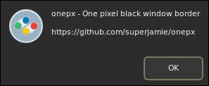

# onepx

A one pixel black window border theme for Metacity, Marco, and XFWM.

## FAQ

* **How do I move windows?**  
    Alt and left-click, drag the window.  
    The window menu (usually Alt+Space) also has a Move command.
* **How do I resize windows?**  
    Alt and right-click, drag the window.  
    The window menu (usually Alt+Space) also has a Resize command.
* **How do I close windows?**  
    Bind this to a key in the Window Manager settings. I use Win+x.  
    The window menu (usually Alt+Space) also has a Close command.
* **How do I maximize windows?**  
    Bind this to a key in the Window Manager settings, the default is usually Alt+F10. I use Win+Up.  
    The window menu (usually Alt+Space) also has a Maximize command.
* **How do I minimize windows?**  
    Bind this to a key in the Window Manager settings, I use Win+Down.  
    The window menu (usually Alt+Space) also has a Minimize command.

## License

[Creative Commons Zero 1.0 Universal](https://creativecommons.org/publicdomain/zero/1.0/)
